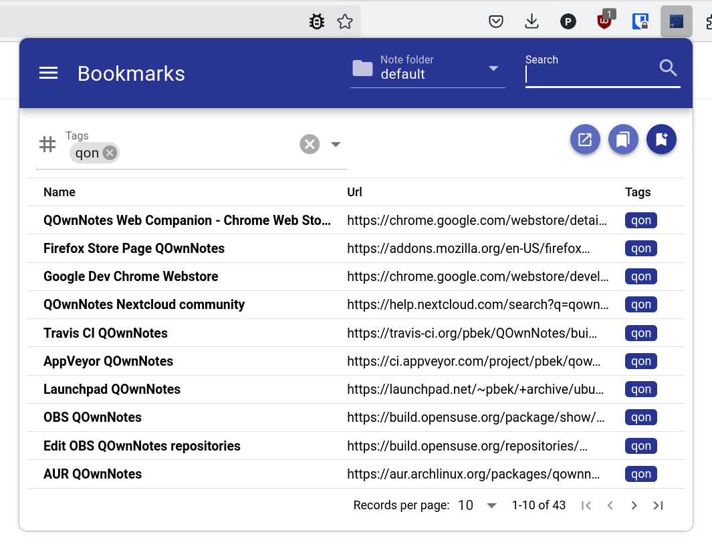

# [QOwnNotes](https://www.qownnotes.org "QOwnNotes Official Site") Web Companion browser extension

[Changelog](https://github.com/qownnotes/web-companion/blob/develop/CHANGELOG.md) |
[Releases](https://github.com/qownnotes/web-companion/releases) |
[Chrome Web Store](https://chrome.google.com/webstore/detail/qownnotes-web-companion/pkgkfnampapjbopomdpnkckbjdnpkbkp) |
[Firefox Add-ons page](https://addons.mozilla.org/firefox/addon/qownnotes-web-companion) |
[QOwnNotes Webpage](https://www.qownnotes.org)


Chrome / Firefox browser extension to interact with the note taking desktop application [QOwnNotes](https://www.qownnotes.org) for managing bookmarks and act as a web-clipper.

[QOwnNotes](https://www.qownnotes.org) is the **open source** (GPL) plain-text file **markdown note taking**
application for GNU/Linux, macOS and Windows, that (optionally) works together with the notes application of
[**ownCloud**](https://github.com/owncloud/notes) or [**Nextcloud**](https://github.com/Nextcloud/notes).

The extension is currently tested for Google Chrome and Mozilla Firefox.

## Features

- **managing bookmarks** with QOwnNotes notes
    - you can browse your QOwnNotes bookmarks
    - you can search for bookmarks and filter them by tag
    - you can add new bookmarks from the current tab or all tabs
    - you can add open all bookmarks in tabs
    - you can import your browser bookmarks to QOwnNotes
    - for more information about the **bookmarks feature** please visit
      [QOwnNotes Web Companion browser extension](https://docs.qownnotes.org/en/latest/getting-started/browser-extension/)
- creating a new note (only text) from the **current selection** by right-clicking it
    - this is scriptable in QOwnNotes
- creating a new note from the content of the **current webpage** by right-clicking on the page
    - the html will be converted to markdown and images of the page will be downloaded (might take a while)
    - this is scriptable in QOwnNotes
- creating a new note with a **screenshot** of the visible part of the current webpage by right-clicking on the page
- you can change the server socket port in the extension *Option page*

## Screenshot



## Installation

Download the latest release from [Releases](https://github.com/qownnotes/web-companion/releases), visit
`chrome://extensions/` (for Chrome) and drop the extension file into your browser.

You can also use the [Chrome Web Store](https://chrome.google.com/webstore/detail/qownnotes-web-companion/pkgkfnampapjbopomdpnkckbjdnpkbkp)
or the [Firefox Add-ons page](https://addons.mozilla.org/firefox/addon/qownnotes-web-companion) to install the extension.

To use this extension [QOwnNotes](https://www.qownnotes.org) needs to be running.

## Shortcuts

### Chrome

- use <kbd>Ctrl + B</kbd> to open the bookmarks popup
    - access key <kbd>A</kbd> to add a new bookmarks (for example press <kbd>Alt + A</kbd> in Chrome)
    - access key <kbd>S</kbd> to search for bookmarks
    - access key <kbd>O</kbd> to open all visible bookmarks
    - access key <kbd>T</kbd> to jump to the tag selector

### Firefox

- use <kbd>Ctrl + Shift + B</kbd> to open the bookmarks popup

## Permissions

- the extension uses the `tabs` permission that may be interpreted as permission to `Read your browsing history` to be able to store bookmarks for all open tabs in a window with a single click

## Development

```bash
npm install

npm run dev chrome
npm run dev firefox
```

## Building packages

```bash
./build.sh
```
